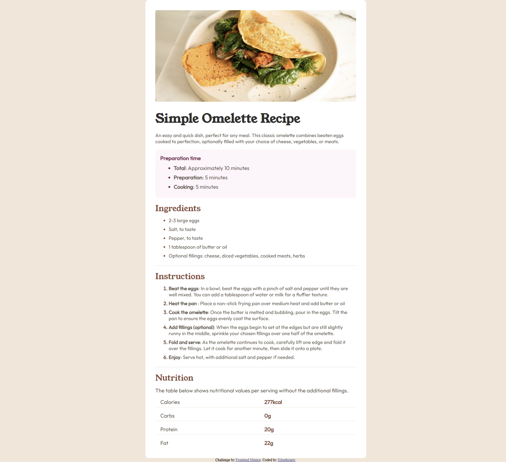

# Frontend Mentor - Recipe page solution

This is a solution to the [Recipe page challenge on Frontend Mentor](https://www.frontendmentor.io/challenges/recipe-page-KiTsR8QQKm). Frontend Mentor challenges help you improve your coding skills by building realistic projects.

## Table of contents

- [Overview](#overview)
  - [The challenge](#the-challenge)
  - [Screenshot](#screenshot)
  - [Links](#links)
- [My process](#my-process)
  - [Built with](#built-with)
  - [What I learned](#what-i-learned)
  - [Continued development](#continued-development)
  - [AI Collaboration](#ai-collaboration)
- [Author](#author)

## Overview

### Screenshot

### Links

- Solution URL: [https://github.com/silentheartzbot/Recipe-page-project](https://github.com/silentheartzbot/Recipe-page-project)
- Live Site URL: [https://silentheartzbot.github.io/Recipe-page-project/](https://silentheartzbot.github.io/Recipe-page-project/)

## My process

### Built with

- Sementic HTML5
  · main
  · article
  · h1
  · h2
  · ol (ordered list)
  · ul (unordered list)
  · table
- CSS Flexbox to cetner
- Google font (Outfit, Young Serif)

### What I learned

Recipe project gave me understanding of how border-bottom property works for elements. I figured out that instead of using 'width' for main container I used max-width so if users using mobile devices width can adjust according to mobile device. If I would have used 'width' instead of 'max-width' then on phone user having 370px screen the content would be still 600px.

### Continued development

I will like to focus on pseudo-element and pseudo-class. I was adding extra span elements to give one color to buttet points and another color to lists so for dots and lists I have created extra span element and it worked but my code structure did not look right. Later I took help from AI mentor and fixed it. I removed extra span for lists and colored lists with li element and for dots and numbers I used ::marker pseudo element.

### AI Collaboration

Claude AI as a mentor

## Author

- Frontend Mentor - [@silentheartzbot](https://www.frontendmentor.io/profile/silentheartzbot)
- Github - [silentheartzbot](https://github.com/silentheartzbot)
